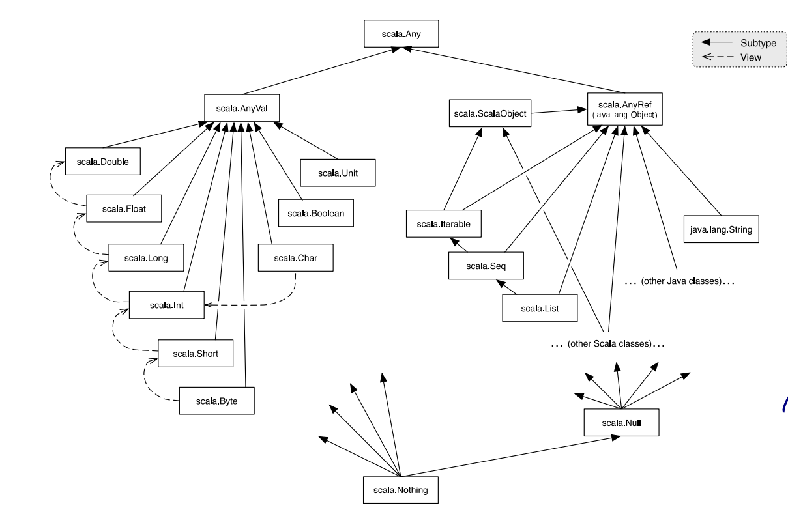

# How classes are organized?

Classes and objects are organized in packages.
To place a class or object inside a packages, use a package clause at the top of your source file.

```scala
package progfun.example 
object HelloWorld{
    ...
}
```

You can refer to `HelloWorld` by it's fully qualified name `progfun.example.HelloWorld`. To run the object

> scala progfun.example.HelloWorld

You can import from any package or object.

All members of 

* package `scala`
* package `java.lang`
* singleton object `Scala.PreDef`
  
are imported in any Scala program. `require` and `assert` are defined in `Scala.PreDef`.

See [here](https://www.scala-lang.org/files/archive/api/current/) for more detailed documentation online.

## Traits

In Java, as well as in Scala, a class can have only one superclass. But what if a class, has several natural types to which it conforms or from which it wants to inherit code?

Here you could use traits.

```scala

trait Planar{
    def height: Int
    def width: Int
    def surface: Int = height * width
}
```

Classes, objects and traits can inherit from at most one class but arbitrary many traits.

```scala

class Square extends Shape with Planar with Movable ...

```

In the above example `Square` extends super class `Shape` but mixes with traits `Planar` and `Movable`. Traits resemble interfaces in Java, but more powerful because they can contains fields and concrete methods.
On the other hand traits cannot have value parameters, only classes can have it.

See the below picture of Scala's class Hierarchy



`Nothing` is at the bottom of the Scala's type hierarchy. It's a subtype of every other type. There is no value of type `Nothing`.

Useful to

* signal abnormal termination
* an element type of empty collection. (Example : `Set[Nothing]` is empty set).

Another example, the expression

```scala
throw Exc
```

aborts the evaluation with the Exception `Exc`. The type of the expression is``Nothing`.

`Scala.Null` is subtype of every reference type. It's value is `null`. It is a value of every reference type. If somebody expects a `String` you can pass `Null`.

```scala

val x = null
val y:String = x
val z: Int = x // Won't compile. Null is subtype of reference only.
```

-------------------------------------------------------------------

````{panels}
:column: col-lg-12 p-2

{badge}`Exercise`

What is the value of the following expression?
```scala
if (true) 1 else false
```
````

````{dropdown} Solution
`AnyVal`. See the above chart. The two branches contains `Int` and other one `Boolean`. So the common supertype is `AnyVal`.
````

--------------------------------------------------------------------------------
